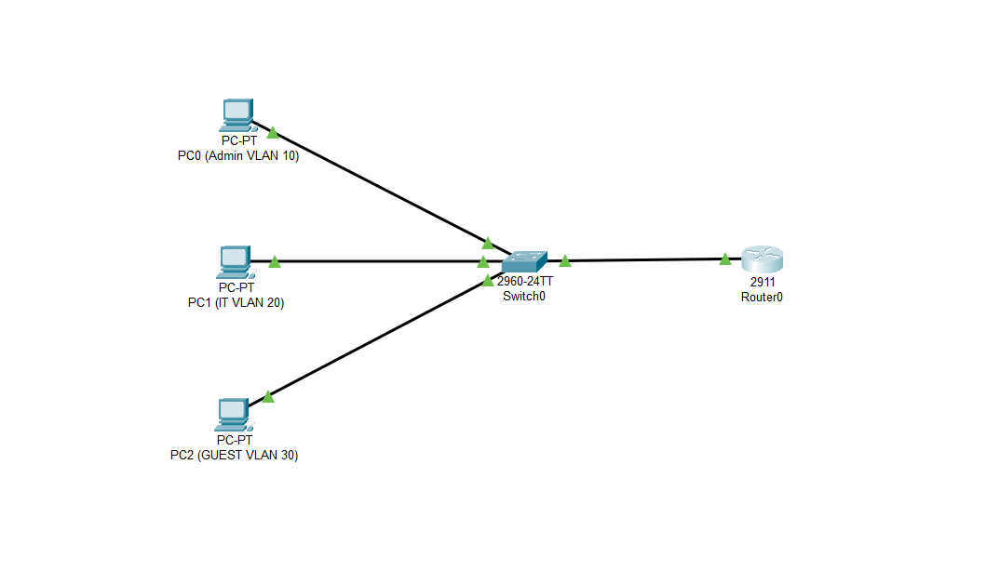
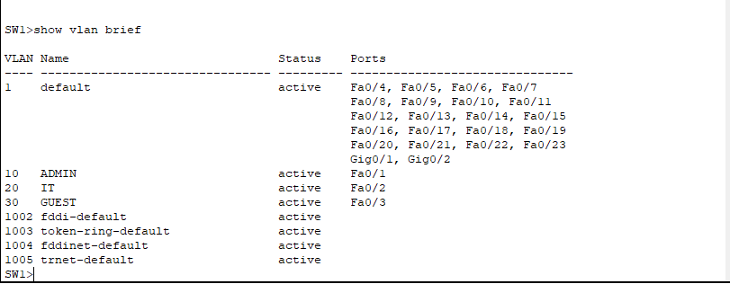
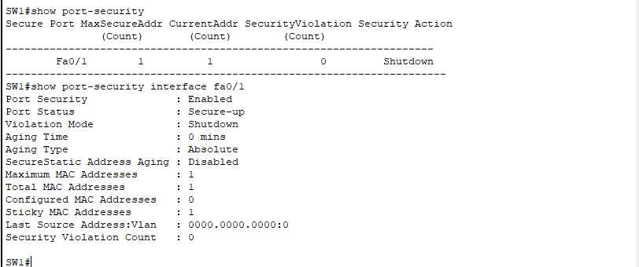
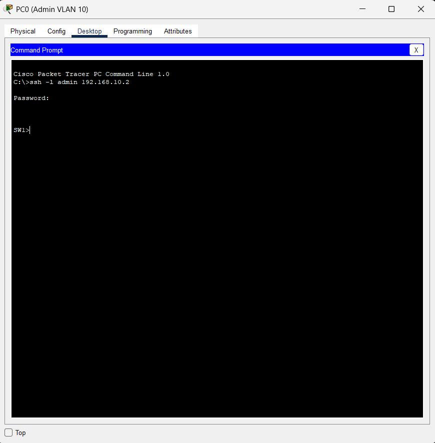
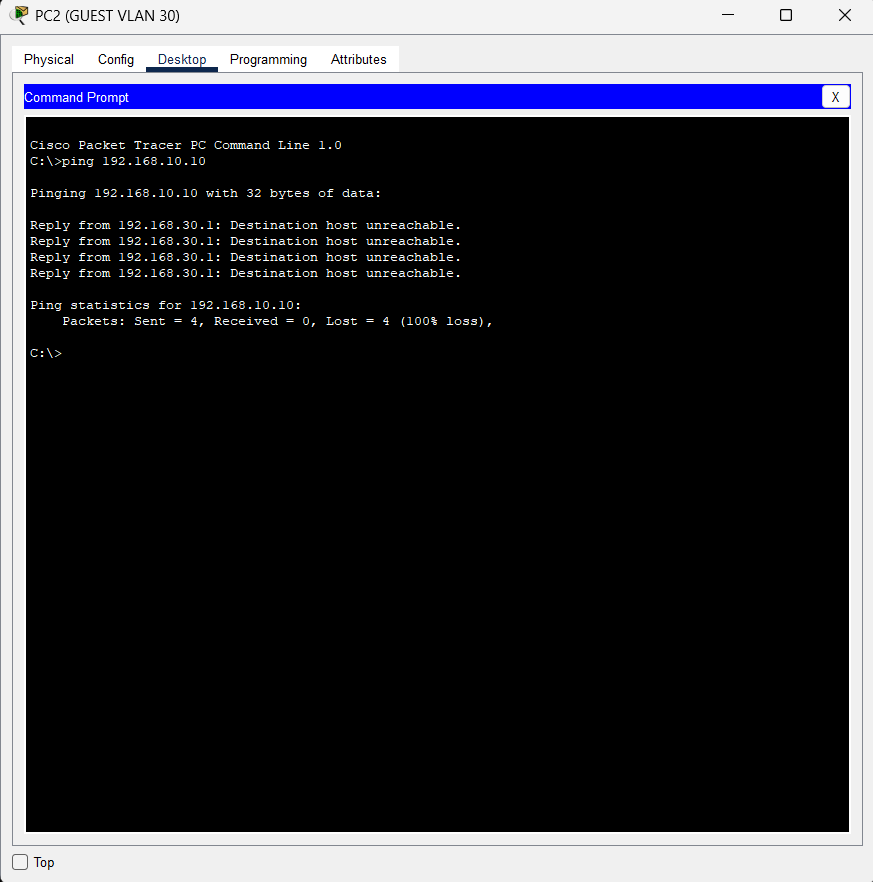
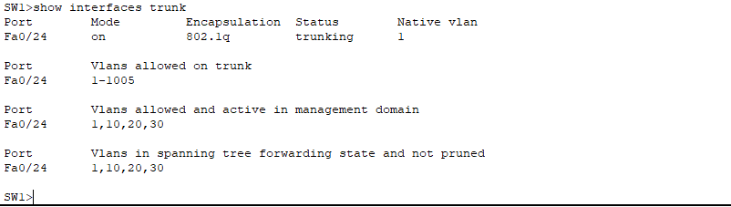

# 🔐 CCNA Network Security Mini Lab

A hands-on Cisco Packet Tracer project that demonstrates essential CCNA security concepts, including VLAN segmentation, inter-VLAN routing, port security, SSH remote management, switch hardening, and Access Control Lists (ACLs).

## 📌 Features

- VLAN configuration (Admin, IT, Guest)
- Inter-VLAN routing (Router-on-a-Stick)
- 802.1Q trunking
- SSH secure remote access
- Port Security with Sticky MAC
- Disabled unused switch ports
- ACL to restrict Guest network access
- Connectivity and security testing

---

## 🏗️ Network Topology

### Devices

- Cisco 2911 Router
- Cisco 2960 Switch
- 3 PCs

### Network Design

| VLAN | Department | Network |
|------|------------|----------------|
| 10 | Admin | 192.168.10.0/24 |
| 20 | IT | 192.168.20.0/24 |
| 30 | Guest | 192.168.30.0/24 |

---

## 🔌 Connections

| Device | Port | Connected To |
|----------|----------------|----------------|
| PC0 | FastEthernet0 | Switch Fa0/1 |
| PC1 | FastEthernet0 | Switch Fa0/2 |
| PC2 | FastEthernet0 | Switch Fa0/3 |
| Router G0/0 | GigabitEthernet0/0 | Switch Fa0/24 |

---

## 🔒 Security Implementations

### VLAN Segmentation
Separated Admin, IT, and Guest users into different broadcast domains.

### Port Security
- Maximum MAC Addresses: 1
- Sticky MAC Learning
- Violation Mode: Shutdown

### Switch Hardening
- Disabled unused ports
- Configured secure management access

### SSH Remote Access
- Local user authentication
- RSA key generation
- SSH-only VTY access

### Access Control List (ACL)
Blocked Guest VLAN from accessing the Admin VLAN while allowing other network communication.

---

## 🧪 Verification

### Connectivity Tests

- ✅ Admin ↔ IT
- ✅ Admin ↔ Guest
- ✅ Guest ↔ IT

### Security Tests

- ❌ Guest → Admin (Blocked by ACL)
- ✅ SSH Login Successful
- ✅ Port Security Enabled

---

## 🛠️ Technologies Used

- Cisco Packet Tracer
- VLANs
- Router-on-a-Stick
- 802.1Q Trunking
- ACLs
- SSH
- Port Security
- Switch Hardening

---

## 📂 Project Files

```text
Network-Security-Mini-Lab/
│
├── network-security-mini-lab.pkt
├── README.md
└── screenshots/
    ├── topology.png
    ├── vlan-config.png
    ├── port-security.png
    ├── ssh-login.png
    ├── acl-test.png
    └── trunk-config.png
```

---

## 🎯 Learning Objectives

This project was created to practice and demonstrate practical CCNA networking and security skills, including:

- Network segmentation
- Secure device management
- Basic enterprise security policies
- VLAN and trunk configuration
- Router-on-a-Stick implementation
- Access control using ACLs

---

## 📸 Sample Security Policy

**Rule:** Guest users are not allowed to access the Admin network.

| Source | Destination | Action |
|----------|----------------|--------|
| 192.168.30.0/24 | 192.168.10.0/24 | DENY |

---

## 🚀 Future Improvements

- DHCP Configuration
- NAT/PAT
- OSPF Routing
- Syslog Server
- NTP Configuration
- Multi-Switch Topology
- Web and DNS Servers

---

## 📷 Suggested Screenshots

Add these images to the `screenshots/` folder and reference them in this README.

### Network Topology



### VLAN Configuration



### Port Security



### SSH Login



### ACL Verification



### Trunk Configuration



---

## 👨‍💻 Author

CCNA Practice Project built with Cisco Packet Tracer for networking and security skill development.
